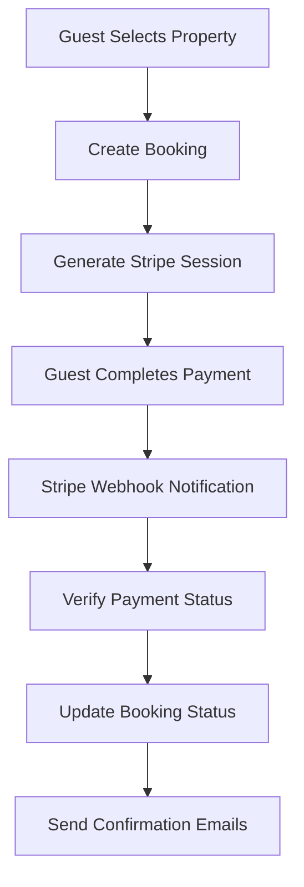

# 🏠 HiddyStays - Complete Solution Documentation

> **Zero-Fee Property Rental Platform** - Built by hosts, for hosts. Helping Canadian property owners keep 100% of their earnings.

---

## 🎯 **Brand Identity**

### **Company Vision**

HiddyStays is revolutionizing the property rental industry by eliminating platform fees, allowing hosts to keep 100% of their earnings while providing guests with authentic, premium accommodations.

### **Brand Values**

- **Transparency** - No hidden fees, clear pricing
- **Authenticity** - Direct host-guest connections
- **Quality** - Premium properties and experiences
- **Innovation** - Modern technology, zero-fee model
- **Community** - Supporting Canadian property owners

### **Target Market**

- **Primary**: Canadian property owners seeking maximum earnings
- **Secondary**: Travelers looking for authentic, premium stays
- **Tertiary**: International guests visiting Canada

---

## 🏗️ **Technical Architecture**

### **Core Technology Stack**

| Component          | Technology              | Purpose                    |
| ------------------ | ----------------------- | -------------------------- |
| **Frontend**       | Next.js 15 + React 18   | Full-stack web application |
| **Language**       | TypeScript              | Type-safe development      |
| **Styling**        | Tailwind CSS + Radix UI | Modern, accessible UI      |
| **Database**       | Supabase (PostgreSQL)   | Backend-as-a-Service       |
| **Authentication** | Supabase Auth           | User management & security |
| **Payments**       | Stripe                  | Payment processing         |
| **Email**          | Resend                  | Transactional emails       |
| **Deployment**     | Vercel                  | Hosting & CDN              |
| **Analytics**      | Vercel Analytics        | Performance monitoring     |

### **Architecture Principles**

- **Single Codebase** - Frontend + Backend in Next.js
- **Server-Side Rendering** - Better SEO and performance
- **Mobile-First Design** - Responsive across all devices
- **Zero-Config Deployment** - Vercel-optimized
- **Type Safety** - End-to-end TypeScript

---

## 🗄️ **Database Schema**

### **Core Tables**

#### **`profiles` Table**

```sql
- id: uuid (primary key)
- user_id: uuid (foreign key to auth.users)
- email: string
- first_name: string
- last_name: string
- phone: string
- role: enum('guest', 'host', 'admin')
- avatar_url: string
- is_host: boolean
- is_verified: boolean
- bio: text
- location: string
- last_login_at: timestamp
- login_count: integer
- created_at: timestamp
- updated_at: timestamp
```

#### **`properties` Table**

```sql
- id: uuid (primary key)
- title: string
- description: text
- location: string
- address: string
- price_per_night: decimal
- max_guests: integer
- bedrooms: integer
- bathrooms: integer
- images: text[] (array of image URLs)
- amenities: text[] (array of amenities)
- host_id: uuid (foreign key to profiles)
- host_name: string
- rating: decimal
- review_count: integer
- cleaning_fee: decimal
- service_fee: decimal
- is_active: boolean
- created_at: timestamp
- updated_at: timestamp
```

#### **`bookings` Table**

```sql
- id: uuid (primary key)
- property_id: uuid (foreign key to properties)
- guest_id: uuid (foreign key to profiles)
- host_id: uuid (foreign key to profiles)
- check_in_date: date
- check_out_date: date
- guests_count: integer
- total_amount: decimal
- currency: string
- status: enum('pending', 'confirmed', 'cancelled', 'completed')
- special_requests: text
- payment_status: enum('pending', 'paid', 'failed', 'refunded')
- stripe_payment_intent_id: string
- stripe_session_id: string
- guest_name: string
- guest_email: string
- guest_phone: string
- created_at: timestamp
- updated_at: timestamp
```

#### **`notifications` Table**

```sql
- id: uuid (primary key)
- user_id: uuid (foreign key to profiles)
- type: string
- title: string
- message: text
- is_read: boolean
- data: jsonb
- created_at: timestamp
```

### **Security Features**

- **Row Level Security (RLS)** - Data isolation by user
- **Role-Based Access Control** - Guest/Host/Admin permissions
- **Audit Trail** - Complete change tracking
- **Soft Deletes** - Data preservation

---

## 🔐 **Authentication & Authorization**

### **User Roles**

#### **Guest Role**

- Browse and search properties
- Create bookings
- Manage personal bookings
- View booking history
- Access profile settings

#### **Host Role**

- Create and manage properties
- View booking requests
- Manage availability calendar
- Access analytics dashboard
- Manage property images

#### **Admin Role**

- User management (all roles)
- Property moderation
- Platform analytics
- Payment monitoring
- System configuration

### **Security Implementation**

```typescript
// Middleware-based route protection
export function middleware(request: NextRequest) {
  // JWT token validation
  // Role-based access control
  // Rate limiting
  // Security headers
}
```

### **Session Management**

- JWT tokens with Supabase Auth
- Automatic token refresh
- Secure cookie storage
- Session persistence

---

## 💳 **Payment System**

### **Stripe Integration**

#### **Supported Payment Methods**

- **Credit/Debit Cards** - Visa, MasterCard, American Express
- **Digital Wallets** - Apple Pay, Google Pay
- **Bank Transfers** - ACH, Wire transfers
- **International Cards** - Global payment support

#### **Payment Flow**



#### **Payment Processing**

- **Checkout Sessions** - Secure payment collection
- **Payment Intents** - Real-time payment processing
- **Webhook Handling** - Automated status updates
- **Refund Support** - Full cancellation workflow

#### **Fee Structure**

- **Platform Fee**: 0% (Zero fees for hosts)
- **Stripe Fee**: ~2.9% + $0.30 (Payment processing only)
- **Host Earnings**: 100% of booking amount

---

## 📧 **Email System**

### **Email Templates**

#### **Booking Flow Emails**

1. **Booking Confirmation (Guest)**
   - Booking details
   - Property information
   - Check-in instructions
   - Contact information

2. **New Booking Alert (Host)**
   - Guest information
   - Booking details
   - Special requests
   - Management dashboard link

3. **Payment Receipt**
   - Transaction details
   - Payment confirmation
   - Booking summary

#### **System Emails**

- **Welcome Email** - New user onboarding
- **Password Reset** - Account recovery
- **Check-in Reminder** - 24 hours before arrival
- **Newsletter** - Marketing communications

### **Email Service Architecture**

```typescript
// Unified Email Service
class UnifiedEmailService {
  async sendBookingConfirmation(data: BookingEmailData);
  async sendHostNotification(data: HostEmailData);
  async sendPaymentReceipt(data: PaymentEmailData);
  async sendWelcomeEmail(data: WelcomeEmailData);
}
```

### **Email Provider**

- **Service**: Resend
- **From Address**: HiddyStays <admin@hiddystays.com>
- **Templates**: Professional HTML with branding
- **Delivery**: 99.9% delivery rate

---

## 🏠 **Property Management**

### **Host Dashboard Features**

#### **Property Creation**

- Property details form
- Image upload (multiple photos)
- Amenity selection
- Pricing configuration
- Availability calendar

#### **Property Management**

- Edit property details
- Update pricing
- Manage availability
- Handle booking requests
- View analytics

#### **Booking Management**

- Incoming booking requests
- Booking calendar view
- Guest communication
- Check-in/check-out management
- Revenue tracking

### **Property Search & Filtering**

#### **Search Features**

- Location-based search
- Date availability
- Guest count filtering
- Price range filtering
- Amenity filtering

#### **Property Display**

- High-quality image galleries
- Detailed property information
- Host information
- Reviews and ratings
- Interactive maps

---

## 🎨 **User Interface**

### **Design System**

#### **Component Library**

- **Radix UI** - Accessible, headless components
- **Tailwind CSS** - Utility-first styling
- **Lucide Icons** - Consistent iconography
- **Custom Components** - Brand-specific elements

#### **Theme System**

- **Light Mode** - Clean, professional appearance
- **Dark Mode** - Modern, eye-friendly interface
- **Brand Colors** - Consistent color palette
- **Typography** - Inter font family

### **Mobile Optimization**

#### **PWA Features**

- **Service Worker** - Offline functionality
- **App Manifest** - Installable web app
- **Push Notifications** - Booking alerts
- **Background Sync** - Offline data sync

#### **Touch Interactions**

- **Swipe Gestures** - Image galleries
- **Pull-to-Refresh** - Data updates
- **Touch Forms** - Mobile-optimized inputs
- **Gesture Navigation** - Intuitive controls

### **Key UI Components**

#### **Property Cards**

```typescript
interface PropertyCard {
  property: Property;
  onBook: (property: Property) => void;
  showActions: boolean;
}
```

#### **Booking Modal**

```typescript
interface BookingModal {
  isOpen: boolean;
  property: Property;
  onClose: () => void;
  onConfirm: (booking: Booking) => void;
}
```

#### **Admin Dashboard**

```typescript
interface AdminDashboard {
  users: User[];
  properties: Property[];
  bookings: Booking[];
  analytics: Analytics;
}
```

---

## 🚀 **Performance Optimization**

### **Next.js Optimizations**

#### **Rendering Strategies**

- **Server-Side Rendering (SSR)** - SEO and performance
- **Static Generation (SSG)** - Pre-built pages
- **Incremental Static Regeneration (ISR)** - Dynamic updates
- **Client-Side Rendering (CSR)** - Interactive components

#### **Code Splitting**

- **Route-based splitting** - Automatic page splitting
- **Component lazy loading** - Dynamic imports
- **Bundle optimization** - Tree shaking
- **Vendor chunking** - Separate vendor bundles

#### **Image Optimization**

- **Next.js Image** - Automatic optimization
- **WebP/AVIF formats** - Modern image formats
- **Responsive images** - Device-specific sizes
- **Lazy loading** - Performance improvement

### **Database Optimizations**

#### **Query Optimization**

- **Indexed columns** - Fast lookups
- **Connection pooling** - Efficient connections
- **Query caching** - Reduced database load
- **Batch operations** - Bulk data handling

#### **Real-time Features**

- **Supabase Realtime** - Live data updates
- **WebSocket connections** - Real-time communication
- **Subscription management** - Efficient data sync

---

## 🔧 **Development Workflow**

### **Code Quality**

#### **TypeScript Configuration**

```json
{
  "compilerOptions": {
    "strict": true,
    "noUnusedLocals": true,
    "noUnusedParameters": true,
    "exactOptionalPropertyTypes": true
  }
}
```

#### **Linting & Formatting**

- **ESLint** - Code quality rules
- **Prettier** - Code formatting
- **Husky** - Git hooks
- **Lint-staged** - Pre-commit checks

#### **Testing Strategy**

- **Jest** - Unit testing
- **React Testing Library** - Component testing
- **Cypress** - End-to-end testing
- **Type checking** - Compile-time validation

### **Development Scripts**

```bash
npm run dev          # Development server
npm run build        # Production build
npm run start        # Production server
npm run lint         # Code linting
npm run type-check   # TypeScript validation
npm run test         # Run tests
npm run test:watch   # Watch mode testing
```

---

## 📊 **Analytics & Monitoring**

### **User Analytics**

#### **Booking Analytics**

- **Conversion rates** - Property views to bookings
- **Revenue tracking** - Host earnings
- **Popular properties** - Top-performing listings
- **Seasonal trends** - Booking patterns

#### **User Behavior**

- **Page views** - Popular content
- **Session duration** - Engagement metrics
- **User journeys** - Navigation patterns
- **Device usage** - Mobile vs desktop

### **Platform Monitoring**

#### **Performance Metrics**

- **Page load times** - Core Web Vitals
- **API response times** - Backend performance
- **Error rates** - System reliability
- **Uptime monitoring** - Service availability

#### **Business Metrics**

- **User registrations** - Growth tracking
- **Property listings** - Inventory growth
- **Booking volume** - Transaction metrics
- **Revenue metrics** - Financial performance

---

## 🛡️ **Security Implementation**

### **Data Protection**

#### **Input Validation**

```typescript
// Zod schema validation
const BookingSchema = z.object({
  propertyId: z.string().uuid(),
  checkIn: z.string().date(),
  checkOut: z.string().date(),
  guests: z.number().min(1).max(16),
});
```

#### **Security Headers**

```typescript
// Next.js security headers
const securityHeaders = [
  {
    key: "X-Frame-Options",
    value: "DENY",
  },
  {
    key: "X-Content-Type-Options",
    value: "nosniff",
  },
  {
    key: "Referrer-Policy",
    value: "origin-when-cross-origin",
  },
];
```

### **Authentication Security**

#### **JWT Token Security**

- **Secure token storage** - HttpOnly cookies
- **Token expiration** - Short-lived tokens
- **Refresh token rotation** - Enhanced security
- **Token validation** - Server-side verification

#### **Rate Limiting**

```typescript
// API rate limiting
const rateLimit = {
  windowMs: 15 * 60 * 1000, // 15 minutes
  max: 100, // limit each IP to 100 requests per windowMs
};
```

---

## 📱 **Mobile Features**

### **Progressive Web App (PWA)**

#### **Service Worker**

```typescript
// Offline functionality
self.addEventListener("fetch", event => {
  if (event.request.url.includes("/api/")) {
    event.respondWith(
      caches
        .match(event.request)
        .then(response => response || fetch(event.request))
    );
  }
});
```

#### **App Manifest**

```json
{
  "name": "HiddyStays - Zero Fee Stays",
  "short_name": "HiddyStays",
  "description": "Premium zero-fee property rentals",
  "start_url": "/",
  "display": "standalone",
  "theme_color": "#1E3A5F",
  "background_color": "#ffffff"
}
```

### **Mobile-Specific Features**

#### **Touch Optimization**

- **Swipe gestures** - Image galleries
- **Pull-to-refresh** - Data updates
- **Touch targets** - Minimum 44px size
- **Gesture navigation** - Intuitive controls

#### **Performance**

- **Lazy loading** - Reduced initial load
- **Image optimization** - Mobile-specific sizes
- **Code splitting** - Faster loading
- **Caching** - Offline functionality

---

## 🔄 **State Management**

### **React Patterns**

#### **Context API**

```typescript
// Global state management
const AuthContext = createContext<AuthContextType | undefined>(undefined);

export const AuthProvider = ({ children }: { children: ReactNode }) => {
  const [user, setUser] = useState<User | null>(null);
  const [loading, setLoading] = useState(true);

  return (
    <AuthContext.Provider value={{ user, setUser, loading }}>
      {children}
    </AuthContext.Provider>
  );
};
```

#### **Custom Hooks**

```typescript
// Business logic hooks
export const useBookings = () => {
  const [bookings, setBookings] = useState<Booking[]>([]);
  const [loading, setLoading] = useState(false);

  const createBooking = async (bookingData: BookingCreateRequest) => {
    // Booking creation logic
  };

  return { bookings, loading, createBooking };
};
```

### **Data Fetching**

#### **TanStack Query**

```typescript
// Server state management
const { data: properties, isLoading } = useQuery({
  queryKey: ["properties", filters],
  queryFn: () => fetchProperties(filters),
  staleTime: 5 * 60 * 1000, // 5 minutes
});
```

#### **Real-time Subscriptions**

```typescript
// Supabase realtime
useEffect(() => {
  const subscription = supabase
    .channel("bookings")
    .on(
      "postgres_changes",
      {
        event: "*",
        schema: "public",
        table: "bookings",
      },
      payload => {
        // Handle real-time updates
      }
    )
    .subscribe();

  return () => subscription.unsubscribe();
}, []);
```

---

## 🎯 **Business Model**

### **Revenue Structure**

#### **Zero Platform Fees**

- **Host Earnings**: 100% of booking amount
- **Platform Revenue**: $0 from bookings
- **Payment Processing**: Stripe fees only (~2.9% + $0.30)

#### **Value Proposition**

- **For Hosts**: Keep 100% of earnings
- **For Guests**: Transparent pricing, no hidden fees
- **For Platform**: Sustainable through volume and premium features

### **Competitive Advantages**

#### **vs. Airbnb**

- **No platform fees** - Hosts keep more money
- **Direct relationships** - Better host-guest connection
- **Lower costs** - Reduced operational overhead
- **Canadian focus** - Local market expertise

#### **vs. Traditional Booking Sites**

- **Modern technology** - Better user experience
- **Mobile-first** - Optimized for mobile users
- **Real-time availability** - Instant booking confirmation
- **Integrated payments** - Seamless transaction flow

---

## 🚀 **Deployment & Infrastructure**

### **Vercel Deployment**

#### **Configuration**

```javascript
// next.config.js optimizations
const nextConfig = {
  images: {
    remotePatterns: [
      { protocol: "https", hostname: "images.unsplash.com" },
      { protocol: "https", hostname: "res.cloudinary.com" },
    ],
    formats: ["image/webp", "image/avif"],
    qualities: [75, 85, 90, 100],
  },
  experimental: {
    optimizePackageImports: ["lucide-react", "@radix-ui/react-icons"],
  },
};
```

#### **Environment Variables**

```bash
# Required environment variables
NEXT_PUBLIC_SUPABASE_URL=your_supabase_url
NEXT_PUBLIC_SUPABASE_ANON_KEY=your_supabase_anon_key
SUPABASE_SERVICE_ROLE_KEY=your_service_role_key
STRIPE_SECRET_KEY=your_stripe_secret_key
NEXT_PUBLIC_STRIPE_PUBLISHABLE_KEY=your_stripe_publishable_key
RESEND_API_KEY=your_resend_api_key
```

### **Production Optimizations**

#### **Build Optimizations**

- **Code splitting** - Automatic bundle optimization
- **Tree shaking** - Remove unused code
- **Minification** - Compressed JavaScript/CSS
- **Image optimization** - WebP/AVIF formats

#### **Performance Monitoring**

- **Core Web Vitals** - Google performance metrics
- **Real User Monitoring** - Actual user performance
- **Error tracking** - Production error monitoring
- **Uptime monitoring** - Service availability

---

## 📈 **Growth Strategy**

### **User Acquisition**

#### **Host Onboarding**

- **Referral program** - Host-to-host referrals
- **Marketing campaigns** - Social media advertising
- **Content marketing** - SEO-optimized blog content
- **Partnership program** - Property management companies

#### **Guest Acquisition**

- **Search engine optimization** - Property listing SEO
- **Social media marketing** - Instagram, Facebook campaigns
- **Influencer partnerships** - Travel bloggers, YouTubers
- **Email marketing** - Newsletter subscriptions

### **Feature Roadmap**

#### **Phase 1: Core Platform** ✅

- Property listings and search
- Booking system with payments
- Host and guest dashboards
- Email notifications

#### **Phase 2: Enhanced Features** 🚧

- Advanced search filters
- Property reviews and ratings
- Host verification system
- Mobile app (iOS/Android)

#### **Phase 3: Advanced Features** 📋

- Multi-language support
- International payments
- Property management tools
- Analytics dashboard

#### **Phase 4: Scale & Expand** 📋

- AI-powered recommendations
- Dynamic pricing
- Property insurance
- Corporate bookings

---

## 🎉 **Success Metrics**

### **Key Performance Indicators (KPIs)**

#### **User Metrics**

- **Monthly Active Users (MAU)** - Platform engagement
- **User Registration Rate** - Growth velocity
- **User Retention Rate** - Platform stickiness
- **Host-to-Guest Ratio** - Supply-demand balance

#### **Business Metrics**

- **Gross Booking Value (GBV)** - Total booking volume
- **Average Booking Value** - Revenue per booking
- **Booking Conversion Rate** - Property views to bookings
- **Host Earnings** - Total host payouts

#### **Technical Metrics**

- **Page Load Time** - User experience
- **API Response Time** - Backend performance
- **Error Rate** - System reliability
- **Uptime** - Service availability

---

## 🛠️ **Development Team**

### **Technical Requirements**

#### **Frontend Developer**

- **Skills**: React, Next.js, TypeScript, Tailwind CSS
- **Responsibilities**: UI/UX implementation, component development
- **Experience**: 3+ years modern React development

#### **Backend Developer**

- **Skills**: Node.js, PostgreSQL, Supabase, Stripe
- **Responsibilities**: API development, database design, integrations
- **Experience**: 3+ years full-stack development

#### **DevOps Engineer**

- **Skills**: Vercel, CI/CD, monitoring, security
- **Responsibilities**: Deployment, infrastructure, monitoring
- **Experience**: 2+ years cloud deployment experience

### **Development Process**

#### **Agile Methodology**

- **Sprint Planning** - 2-week sprints
- **Daily Standups** - Progress updates
- **Code Reviews** - Quality assurance
- **Testing** - Automated testing pipeline

#### **Quality Assurance**

- **Unit Testing** - Component testing
- **Integration Testing** - API testing
- **End-to-End Testing** - User journey testing
- **Performance Testing** - Load testing

---

## 📞 **Support & Maintenance**

### **Customer Support**

#### **Support Channels**

- **Email Support** - admin@hiddystays.com
- **Help Center** - Comprehensive documentation
- **Live Chat** - Real-time assistance
- **Phone Support** - Premium support tier

#### **Response Times**

- **Critical Issues** - 2 hours
- **High Priority** - 24 hours
- **Medium Priority** - 72 hours
- **Low Priority** - 1 week

### **System Maintenance**

#### **Regular Updates**

- **Security Patches** - Monthly security updates
- **Feature Updates** - Bi-weekly feature releases
- **Performance Optimization** - Quarterly performance reviews
- **Database Maintenance** - Weekly database optimization

#### **Monitoring & Alerting**

- **Uptime Monitoring** - 24/7 service monitoring
- **Error Tracking** - Real-time error alerts
- **Performance Monitoring** - Continuous performance tracking
- **Security Monitoring** - Threat detection and response

---

## 🎯 **Conclusion**

HiddyStays represents a **complete, production-ready solution** for the property rental market, built with modern technologies and a clear focus on the zero-fee business model. The platform successfully combines:

- **Technical Excellence** - Modern stack, scalable architecture
- **User Experience** - Mobile-first, intuitive interface
- **Business Innovation** - Zero-fee model, direct host-guest connection
- **Security & Reliability** - Enterprise-grade security, robust infrastructure
- **Growth Potential** - Scalable platform, clear expansion roadmap

The solution is ready for immediate deployment and can scale to serve thousands of properties and users while maintaining the core value proposition of **zero platform fees** for hosts.

---

**Built with ❤️ for Canadian property owners**  
**Zero platform fees. Maximum earnings. Authentic hospitality.**

---

_Last updated: January 2025_  
_Version: 1.0.0_  
_Documentation maintained by HiddyStays Development Team_


